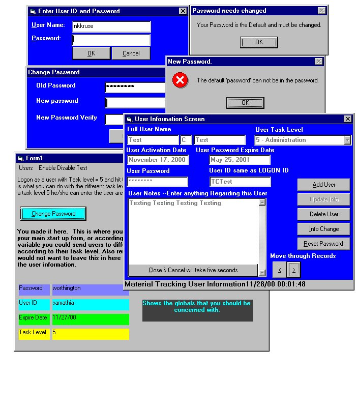



## User Logon and Password with ADO and Access

### Description

Login and Password Security W/ Access and ADO

These forms and modules can be placed in any VB 6.0 project and you add the rest of your forms and you have a secure application. Full functioning: add users, delete users, re-set user password, comments on users, password expire term, default password forced change, user Task levels that you can name. This consist of two modules, three forms, and one data environment. This is all done in VB 6.0 and in ADO format. All kind of validation.
 
### More Info
 
All the globals can be adjusted for your application.

Read the .txt file in the zip first before using.

Security

All fixed that have brought to my attention.

             |
---                |---
**Submitted On**   |2000-11-29 02:49:52
**By**             |[n\_kruse](https://github.com/Planet-Source-Code/PSCIndex/blob/master/ByAuthor/n-kruse.md)
**Level**          |Intermediate
**User Rating**    |4.5 (18 globes from 4 users)
**Compatibility**  |VB 6\.0
**Category**       |[Complete Applications](https://github.com/Planet-Source-Code/PSCIndex/blob/master/ByCategory/complete-applications__1-27.md)
**World**          |[Visual Basic](https://github.com/Planet-Source-Code/PSCIndex/blob/master/ByWorld/visual-basic.md)
**Archive File**   |[CODE\_UPLOAD1217511292000\.zip](https://github.com/Planet-Source-Code/n-kruse-user-logon-and-password-with-ado-and-access__1-13199/archive/master.zip)

### API Declarations

All can be adjusted NO API

